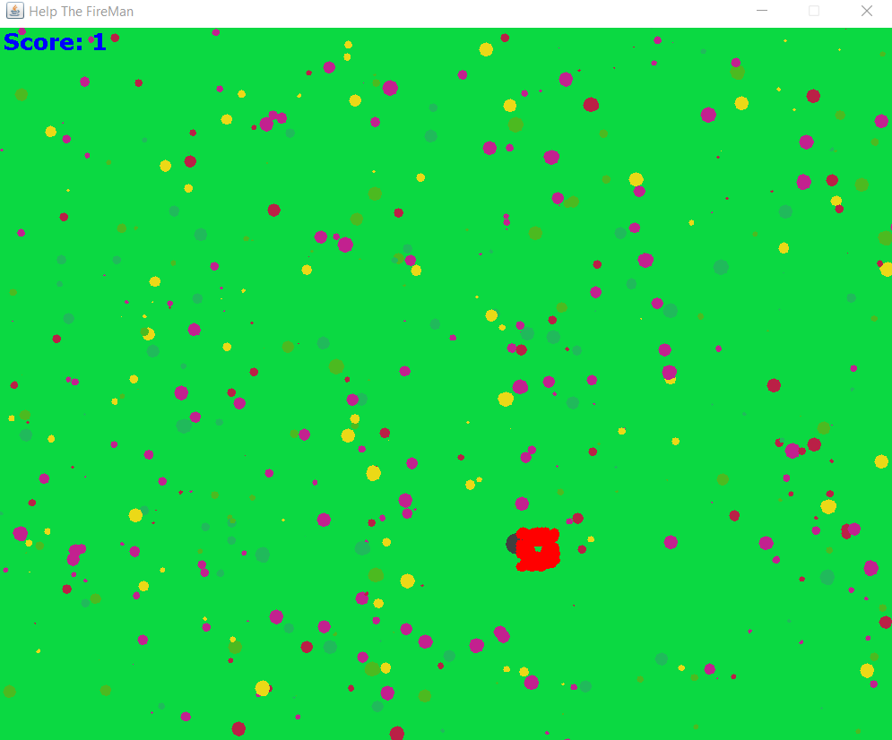
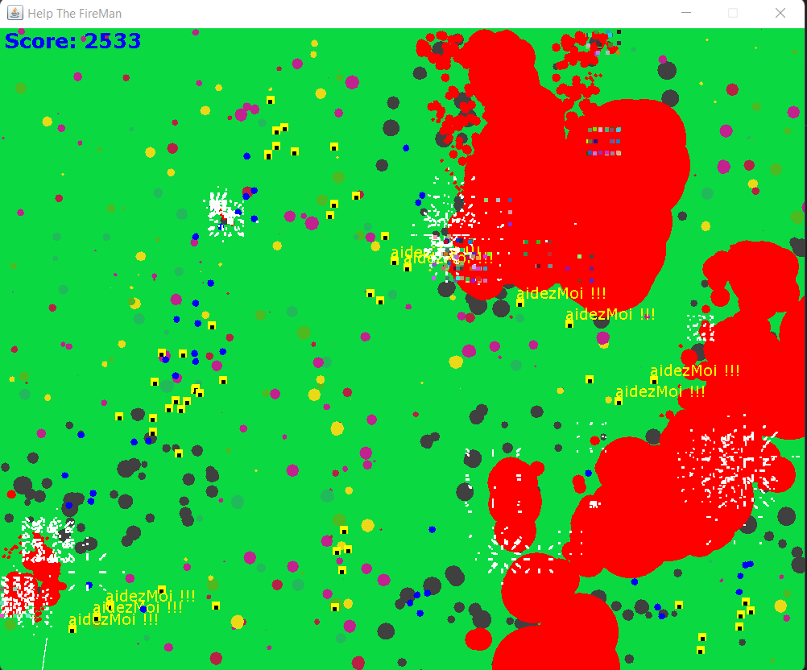
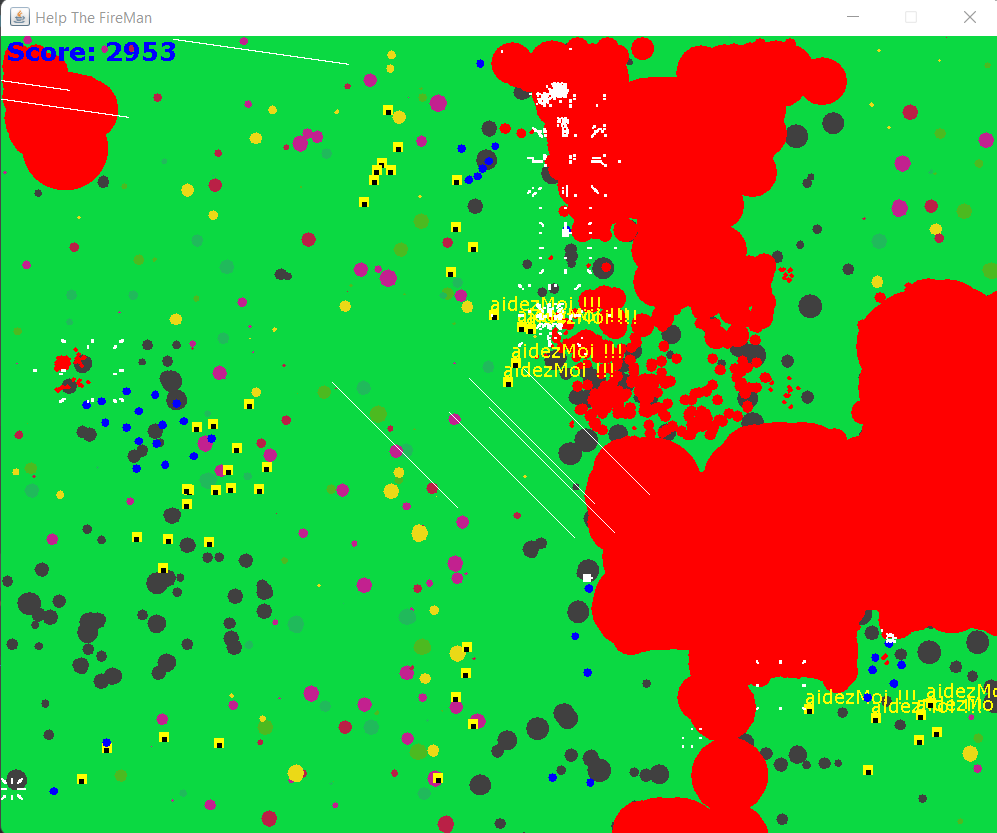

# Help The FireMan

it's a game that I created in 2nd year computer license in the object-oriented programming teaching unit it's a one-player game where the objective is to put out the fire.

# How to play

> Left Mouse  ->  Generate Fire

> Right Mouse ->  Generate Fire Fighters 

> V -> Generate Wind

> P -> Generate Rain

> S -> Display Game Statistics

> C -> Hide The Menu

> Space -> Start The Game

# ScreenShots

In red at the bottom right of the screen we can see the start of a fire.

the black dots represent the burnt trees

FireFighters are represented with yellow dots with the black dot in the center

the white lines represent the wind which pushes the fire in its direction
